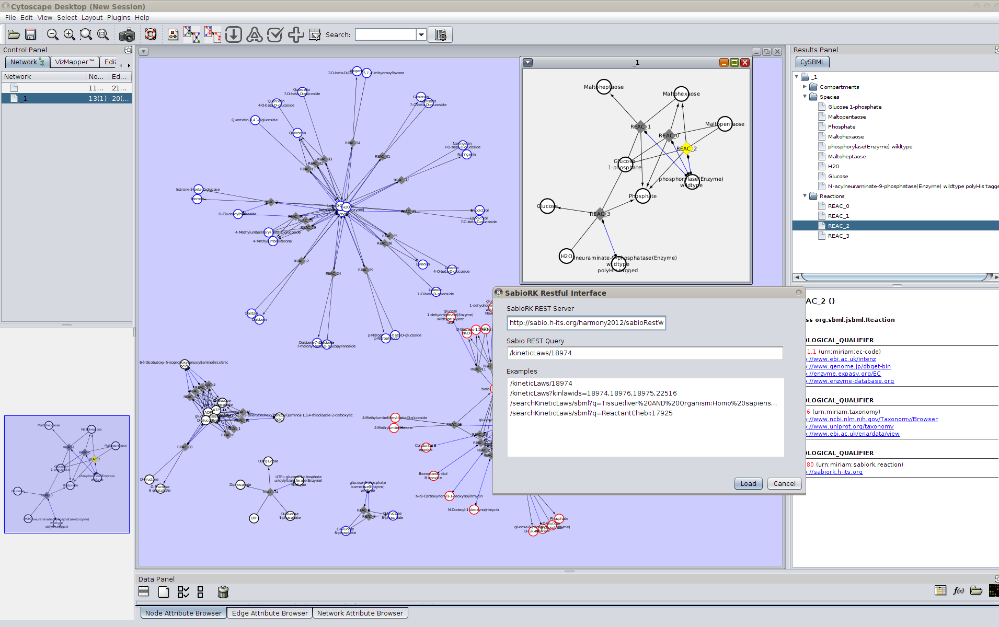

<a href="{{site.github.repository_url}}/blob/gh-pages/{{page.path}}">Edit this page</a>

# Overview
cy2sabiork is an open source [Cytoscape 2](http://www.cytoscape.org) plugin to access kinetic information from the
[SABIO-RK](http://sabio.villa-bosch.de/) reaction kinetics database via the RESTful web service.  

**Latest release**  
https://github.com/matthiaskoenig/cy2sabiork/releases/latest  
**Installation instructions & source code**  
https://github.com/matthiaskoenig/cy2sabiork/  
**Support & Forum**: https://groups.google.com/forum/#!forum/cysbml-cyfluxviz  
**Bug Tracker**: https://github.com/matthiaskoenig/cy2sabiork/issues

This plugin has not been ported to Cytoscape 3 yet.

cy2sabiork was developed by [Matthias König](http://www.charite.de/sysbio/people/koenig/) within the [Virtual Liver Network](http://www.virtual-liver.de). We thank the SABIO-RK team and the Virtual Liver Network (VLN) for their support.

<a href="http://sabio.villa-bosch.de/"></img></a>&nbsp;&nbsp;&nbsp;&nbsp;
<a href="http://www.virtual-liver.de"></img></a>&nbsp;&nbsp;&nbsp;&nbsp;
<a href="http://www.charite.de"></img></a>&nbsp;&nbsp;&nbsp;&nbsp;
<a href="http://www.cytoscape.org"></img></a>&nbsp;&nbsp;&nbsp;&nbsp;
<a href="http://www.sbml.org"></img></a>&nbsp;&nbsp;

## Screenshots
 

**Figure 1 - Import dialog.** Generation of reaction kinetic networks based on arbitrary SABIO-RK RESTful queries. Integration with [cy2sbml](https://github.com/matthiaskoenig/cy2sbml) provides access to annoted species and reaction information.

